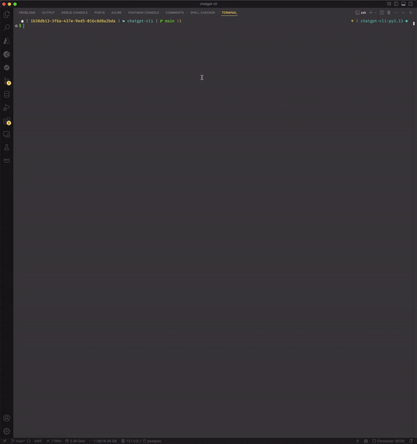

# ChatGPT CLI

## add ypthon version, peotry, ruff


## Description
A Python-based CLI tool for interacting with various OpenAI models using the OpenAI API. The tool allows you to chat with different models, store chat history in a PostgreSQL database, and continue previous conversations using different models.

## Installation and Usage
1. Clone the repository
2. Install dependencies
```bash
poetry install
```
3. Create a `.env` file in the root directory and add the following environment variables:
```bash
OPENAI_API_KEY=
DB_USER=
DB_PASSWORD=
DB_HOST=
DB_PORT=
DB_NAME=
```
4. Run the CLI
```bash
poetry run chatgpt_cli
poetry run chatgpt_cli --no-stream # default
poetry run chatgpt_cli --stream
poetry run chatgpt_cli --read_file <path_to_file>
```

## Roadmap
- [x] Chat with different OpenAI models
- [x] Store chat history in a PostgreSQL database
- [x] Continue previous conversations, if needed
- [x] Continue a conversation with different model than the one used initially
- [x] Load big text file as attachment (Sometimes terminal has limited copy-paste buffer)
- [x] Use different tools by utilizing function calling.
- [x] Activate streaming mode for GPT-4 models. O1 is not supported yet.
- [x] Chat using multiple tools at the same time. 
 

## License
This project is licensed under the MIT License - see the [LICENSE](LICENSE) file for details
